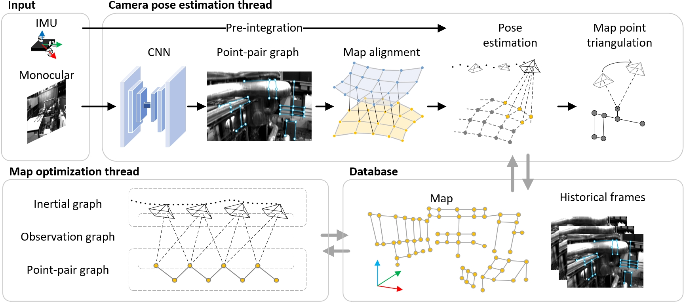

# PPG-SLAM
PPG-SLAM: Real-Time and Robust Visual-Inertial SLAM with Point-Pair Graph

**Related video:** [PPG-SLAM](https://youtu.be/87kftCq5J2I)

**System Overview:**




## 1. Introduction
Different inter-frame feature matching methods and various structured landmarks have been proposed to improve the robustness and accuracy of visual SLAM. However, inter-frame feature matching methods usually ignore the prior information in the incrementally updated map. And the use of multiple geometric landmarks is often redundant, slowing down the map optimization. In this paper, we explicitly express the connection relationship of features by edge information, and then construct a point-pair graph. Leveraging this connection relationship, we directly associate the image with the map to improve the robustness of feature tracking. Furthermore, the co-linear constraints are applied to the map optimization, improving the map accuracy while avoiding computational redundancy. Experimental results show that compared with the inter-frame feature matching method, the image-map association method doubles the number of continuous feature tracking times. In large scenarios, our system reduces the translation drift by 10% but only increases the latency by 2%. Notably, when playing the dataset at 4x speed, our system achieves 18% lower trajectory error than the second place.

## 2. Prerequisited

### 2.1 Ubuntu and ROS2

- Ubuntu 22.04
- ROS-Humble

### 2.2 Eigen && OpenCV && LibTorch

Eigen >= 3.3.7,      Follow [Eigen Installation](https://eigen.tuxfamily.org/index.php?title=Main_Page).

OpenCV >= 4.0.0,  Follow [Opencv Installation](http://opencv.org/).

LibTorch (CUDA >=12.6),  Follow [LibTorch Installation](https://pytorch.org/get-started/locally/).

## 3. Build

Clone the repository and colcon build:

```
mkdir -p ws_ppgslam/src
cd ~/ws_ppgslam/src
git clone https://github.com/NEU-REAL/PPG-SLAM
cd ../
colcon build
```

## 4. Run the package


Launch rviz and SLAM system. Please note that you should change the `Launch/launch.py` to adapt the datasets. The system config files are stored in `config`. The vocabulary is stored in `Vocabulary`. The trained model is stored in `net`.

```
~/ws_ppgslam$ source ~/catkin_ws/install/setup.bash
~/ws_ppgslam$ ros2 launch ppg_slam 
```

Working with open access datasets. We provide tools for [EuRoC MAV](http://robotics.ethz.ch/~asl-datasets/ijrr_euroc_mav_dataset/) and [UMA-VI](https://mapir.isa.uma.es/mapirwebsite/?p=2108&page=2) playback with ros2 topic. Please download the zip file and unzip it, then you can play the datasets by:

```
~/ws_ppgslam$ ros2 run ppg_slam pub_euroc_node <Path to EuRoC MAV dataset>
~/ws_ppgslam$ ros2 run ppg_slam pub_uma_node <Path to UMA VI dataset>
```


## 5. Acknowledgments

Thanks for [ORB_SLAM3](https://github.com/UZ-SLAMLab/ORB_SLAM3), [AirSLAM](https://github.com/sair-lab/AirSLAM), [SOLD2](https://github.com/cvg/SOLD2), and [SuperPoint](https://github.com/magicleap/SuperPointPretrainedNetwork). 

